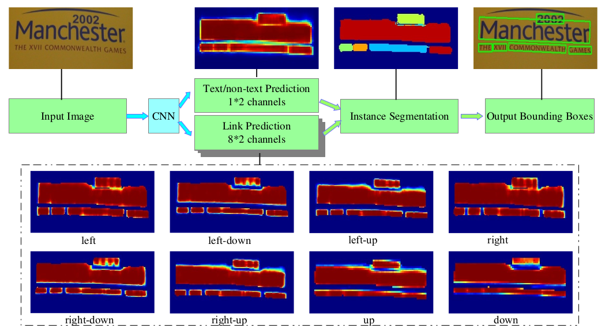
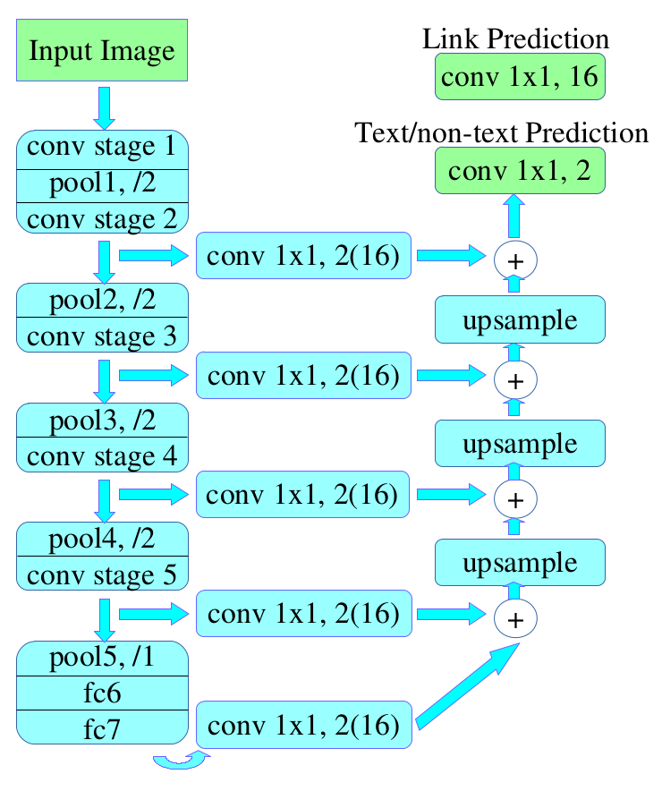

参考博客： [燕小花](https://zhuanlan.zhihu.com/p/38171172)

论文题目： [PixelLink: Detecting Scene Text via Instance Segmentation](arxiv.org/abs/1801.01315)

实现代码： [ZJULearning](github.com/ZJULearning/pixel_link)

---

## 论文概述

目前最先进的场景文本检测算法大都是基于深度学习的，这些算法依赖于bounding box回归，而且至少执行两种预测：文本/非文本分类和位置回归。本文的作者提出的是一种基于实例分割（Instance Segmentation）的场景文本检测算法PixelLink。该算法放弃了bounding box回归的思想，直接采用实例分割对文本行区域进行分割，找到对应文本行的外接矩形框。

### 关键idea
- 提出了通过实例分割进行文本检测
- 提出了基于DNN的两种pixel-wise预测：文本/非文本预测和link预测

## 论文详解
### Architecture of PixelLink

> 图片经由CNN模型训练之后，得到两类pixel-wise预测：文本/非文本预测和link预测。再经过threshold，pos pixels与pos link结合在一起，实现了实例分割。在这个过程中，minAreaRect被用来从分割结果中提取bounding box。通过后处理噪音预测也是很有效的。正如上图所示，每个图片都有八个热点图，分别代表八个方向的link预测。一些很难在文本/非文本预测中分离出来的words，可以在link预测中分离。

本篇论文给出两种网络结构：**PixelLink+VGG16 2s**，**PixelLink+VGG16 4s**。

**PixelLink+VGG16 2s**：feature fusion layers包括{conv2_2，conv3_3，conv4_3，conv5_3，fc_7}，得到特征图的分辨率是原图的1/2。

**PixelLink+VGG16 4s**：feature fusion layers包括{conv3_3，conv4_3，conv5_3，fc_7}，得到特征图的分辨率是原图的1/4。

### 具体步骤

- 主干网络是沿用了SSD网络结构，用VGG16作为base net，并将VGG16的最后两个全连接层改成卷积层；
- 提取不同层的feature map，对于PixelLink+VGG16 2s网络结构：提取了conv2_2，conv3_3，conv4_3，conv5_3，fc_7；
- 对已经提取的特征层，先上采样，再进行add操作；
- 对于网络输出层，包括本文/非文本预测和link预测。

### Linking Pixels Together
通过设定两个不同的阈值，可以得到pixels和links预测，pos pixels通过pos links进行分组，产生conected compoents(CCs)集合，集合中的每一个元素都代表一个被检测的文本实例。两个pos pixels之间的link预测是由两个pos pixels共同决定的，两个link预测中至少有一个pos link。连接的过程使用的是disjoint-set data structure（并查集）。

### Extraction of Bounding Boxes
Bounding boxes of CCs通过OpenCV库中的minAreaRect方法获取，提取出来的是带有方向信息的外接矩形。bbox的获得是直接通过实例分割的，这是与其它基于回归方法的最大区别。

### Post Filtering after Segmentation
pixel进行连接时会引入一些噪声，文中主要是对已检测的bbox通过一些简单的几何形状判断（包括bbox的宽、高、面积及宽高比等，这些主要是在对应的训练集上进行统计出来的）进行filter。

 

